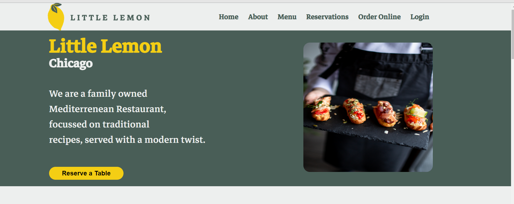
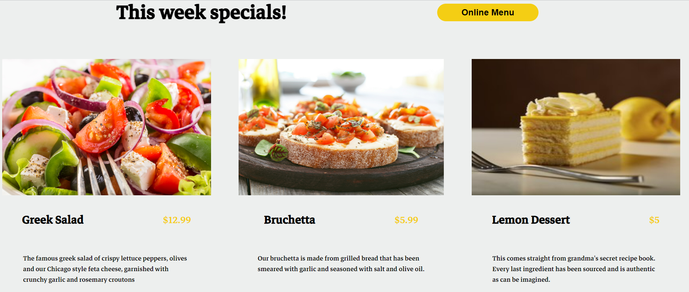
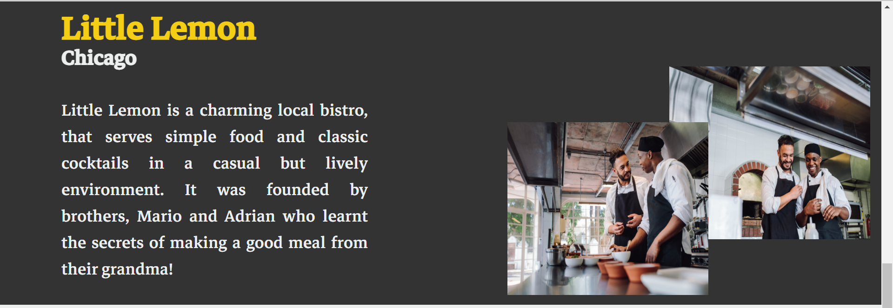
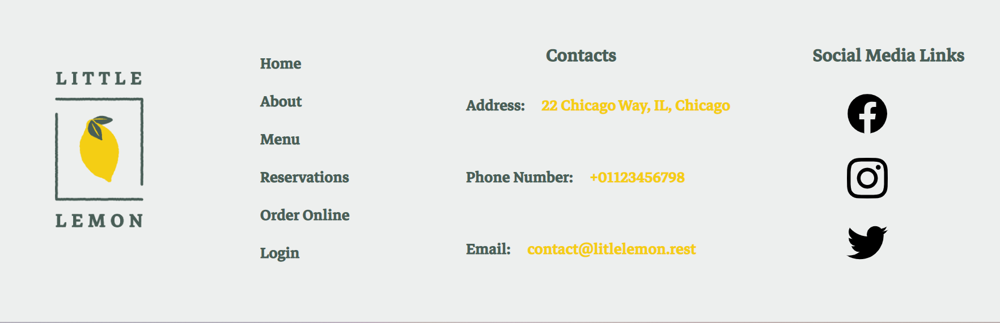
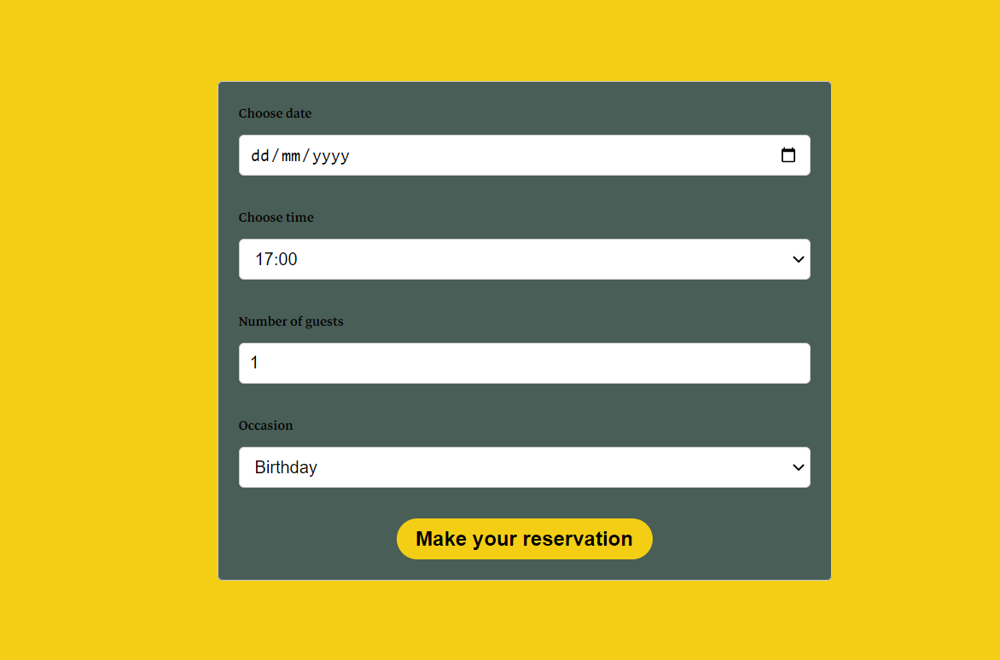
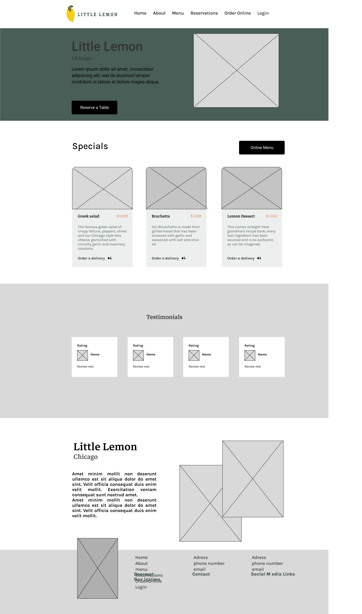

# LitleLemon

## Overview

This application is a website for a fictional restaurant. It consists of a home screen which is divided into sections, a hero section, a special offers section where users can view the menu, an about section and the footer. Other pages of the website include a table reservation page featuring a form that users can used to reserve a table at the restaurant.

## Screenshots

    
    
    

    
    

## Usage
Check out the deployed application on https://litlelemon.netlify.app.

## Credits
* [Guidiance from the Meta React Front-End Developer Specialization offerred on Coursera:](https://www.coursera.org/professional-certificates/meta-front-end-developer)

## Wireframe
Before commencing coding on the project a wireframe was built on figma which served as a guide during the coding phase.

## Languages, Frameworks and Libraries
This app was built with
* React JS
* Javascript
* HTML5
* CSS3

